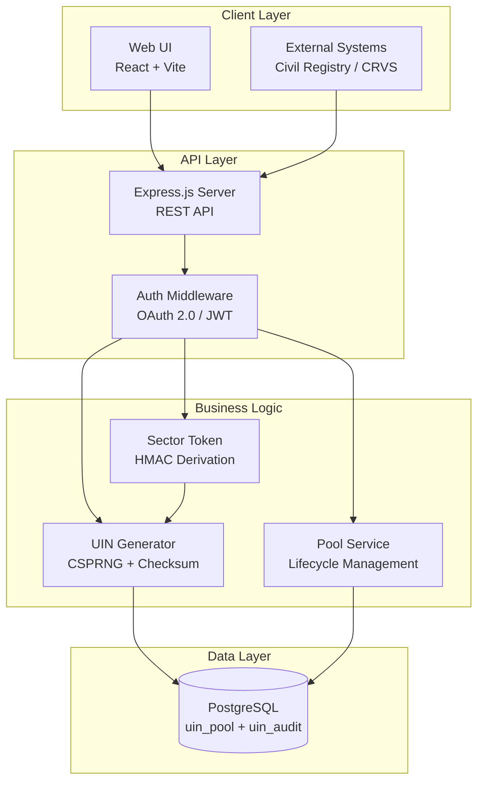
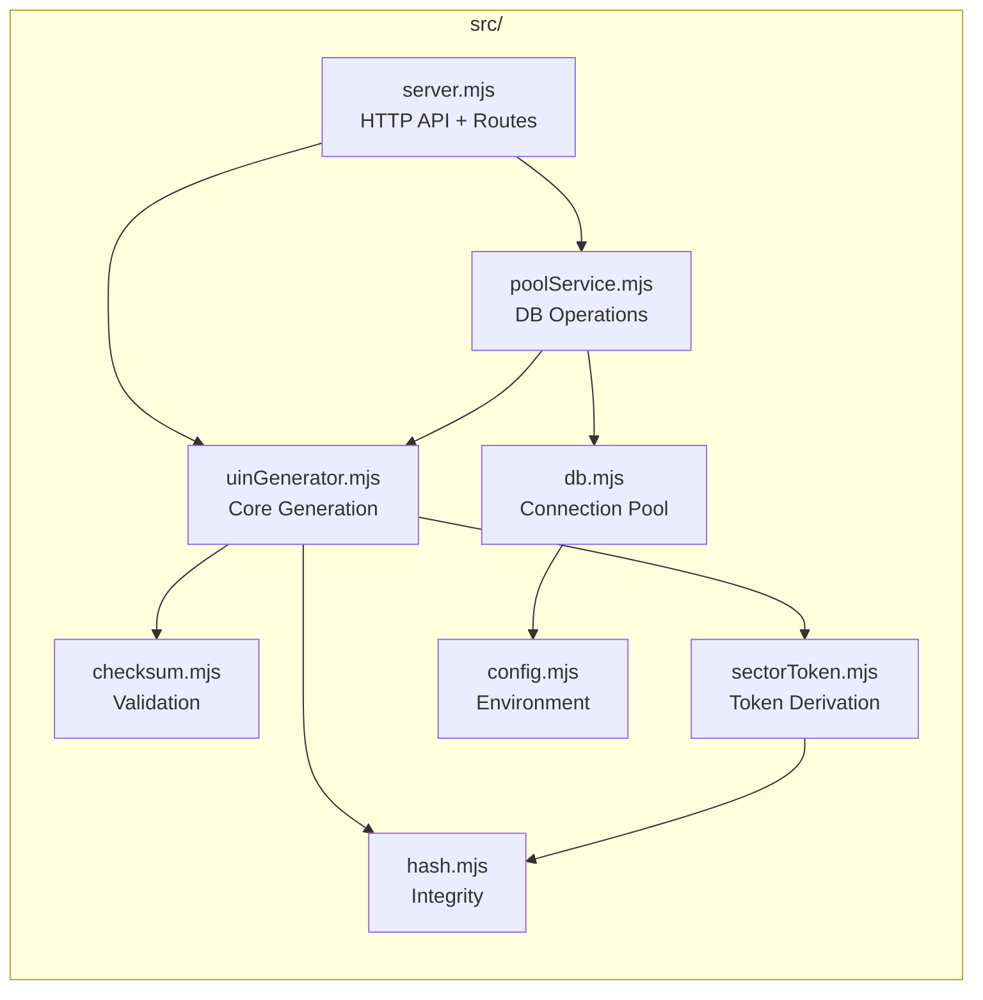
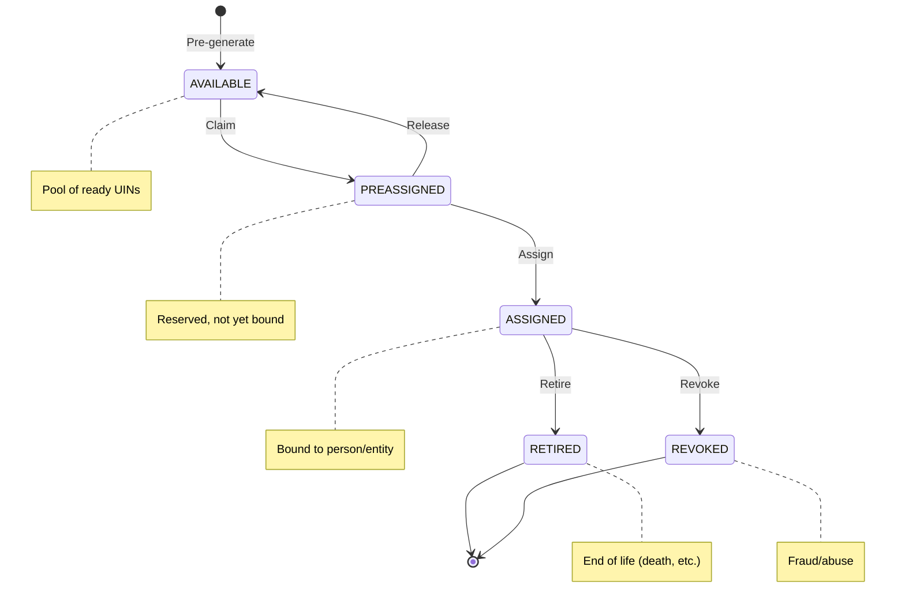
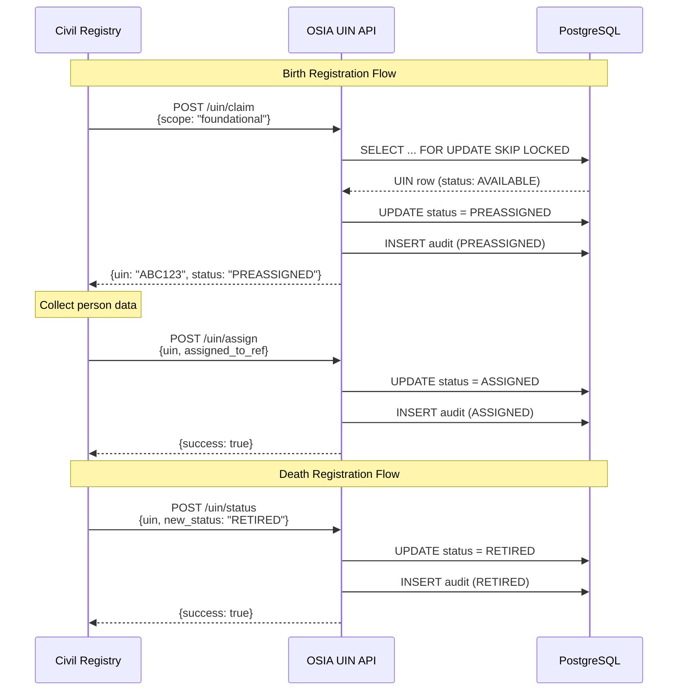
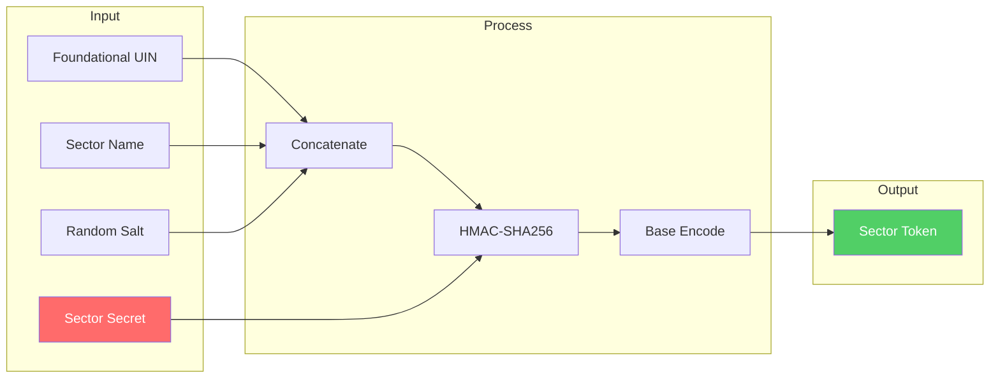
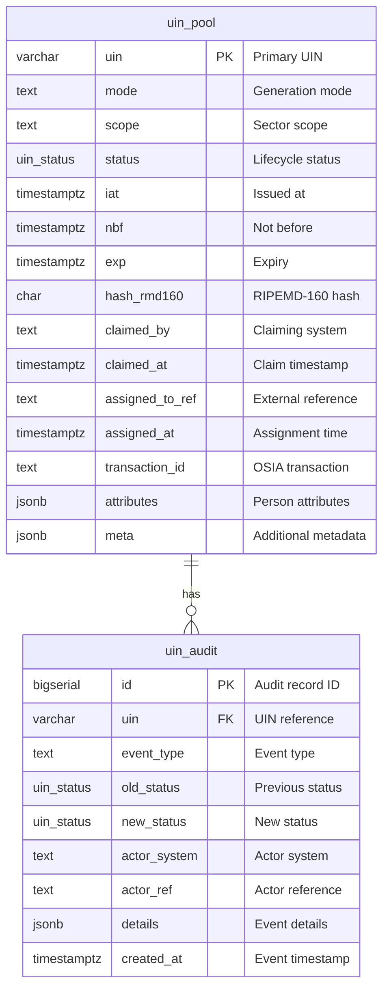
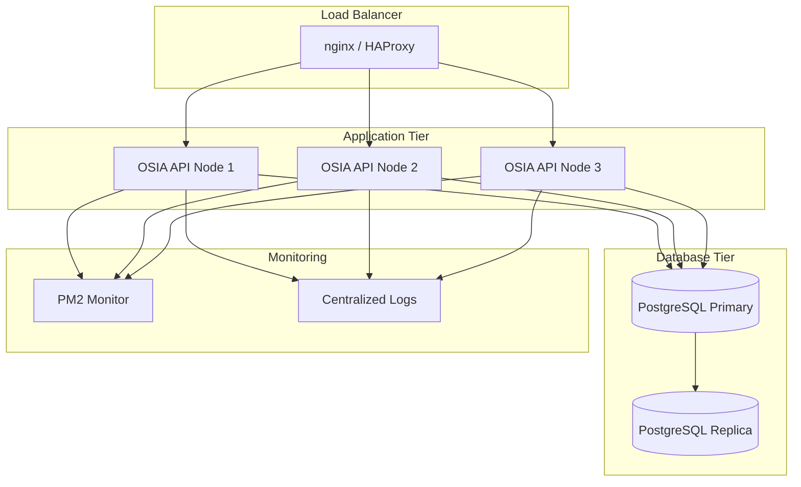

# OSIA UIN Generator v2.0

A production-grade, PostgreSQL-backed **Unique Identification Number (UIN)** generator based on the **[Open Standards for Identity APIs (OSIA)](https://osia.readthedocs.io/)** specification.

**Author:** Tunji Durodola <tunji.d@pocketone.eu>
**Organization:** [Secure Identity Alliance](https://secureidentityalliance.org)
**License:** MIT

---

## Table of Contents

- [Features](#features)
- [Architecture](#architecture)
- [Quick Start](#quick-start)
- [API Reference](#api-reference)
- [UIN Lifecycle](#uin-lifecycle)
- [Generation Modes](#generation-modes)
- [Database Schema](#database-schema)
- [Security](#security)
- [Configuration](#configuration)
- [Deployment](#deployment)
- [Web Interface](#web-interface)
- [Testing](#testing)
- [References](#references)
- [License](#license)

---

## Features

- **OSIA-Based Design** - Implements `POST /v1/uin` endpoint pattern
- **Four Generation Modes** - Foundational, Random, Structured, and Sector Token
- **PostgreSQL Pool Management** - Pre-generation, claiming, and assignment workflows
- **Cryptographic Security** - CSPRNG, HMAC-SHA256, RIPEMD-160 hashing
- **Complete Audit Trail** - Immutable logging of all UIN lifecycle events
- **Sector Tokenization** - Unlinkable, sector-specific derived identifiers
- **RFC 7519 JWT Support** - Token-based UIN representation
- **React Web UI** - Professional interface for UIN management and documentation

### Supported Sectors

| Sector | Description |
|--------|-------------|
| `health` | Healthcare / Medical services |
| `tax` | Tax / Revenue administration |
| `finance` | Financial services |
| `telco` | Telecommunications |
| `stats` | Statistics / Census |
| `education` | Education sector |
| `social` | Social services |
| `government` | Government / Public administration |

---

## Architecture

### High-Level System Overview



### Component Architecture



### Technology Stack

| Layer | Technology | Version |
|-------|------------|---------|
| Runtime | Node.js | 20+ |
| Server | Express.js | 4.x |
| Database | PostgreSQL | 15+ |
| Query Builder | Knex.js | 3.x |
| Frontend | React | 18.x |
| Build Tool | Vite | 5.x |
| Process Manager | PM2 | 6.x |

---

## Quick Start

### Prerequisites

- Node.js 20+
- PostgreSQL 13+ (15+ recommended)
- PM2 (optional, for production)

### Installation

```bash
# Clone the repository
git clone https://github.com/pocketone-eu/osia-uin-generator.git
cd osia-uin-generator

# Install dependencies
npm install

# Install web UI dependencies
cd web && npm install && cd ..

# Configure environment (copy and edit)
cp .env.example .env

# Run database migrations
npm run migrate

# Start the API server
npm start

# Or use PM2 for production
pm2 start ecosystem.config.cjs
```

### Verify Installation

```bash
# Health check
curl http://localhost:19020/health

# Generate a UIN (stateless)
curl -X POST http://localhost:19020/generate \
  -H "Content-Type: application/json" \
  -d '{"mode": "foundational"}'

# Generate via primary endpoint
curl -X POST "http://localhost:19020/v1/uin?transactionId=test-001" \
  -H "Content-Type: application/json" \
  -d '{"firstName": "John", "lastName": "Doe"}'
```

---

## API Reference

### Primary Endpoint

#### `POST /v1/uin`

Generate a new UIN following the OSIA endpoint pattern.

**Query Parameters:**

| Parameter | Type | Required | Description |
|-----------|------|----------|-------------|
| `transactionId` | string | Yes | Transaction identifier for tracking |

**Request Body:**

```json
{
  "firstName": "John",
  "lastName": "Doe",
  "dateOfBirth": "1990-01-15"
}
```

**Response (200 OK):**

```
"ABCD1234EFGH5678XYZ"
```

**Error Response:**

```json
{
  "code": 400,
  "message": "Missing transactionId parameter"
}
```

---

### Pool Management Endpoints

| Method | Endpoint | Description |
|--------|----------|-------------|
| `GET` | `/pool/stats` | Get pool statistics by scope |
| `POST` | `/uin/pre-generate` | Batch pre-generate UINs |
| `POST` | `/uin/claim` | Claim available UIN (AVAILABLE → PREASSIGNED) |
| `POST` | `/uin/assign` | Assign UIN (PREASSIGNED → ASSIGNED) |
| `POST` | `/uin/release` | Release UIN back to pool |
| `POST` | `/uin/status` | Update UIN status (retire, revoke) |
| `GET` | `/uin/:uin` | Lookup UIN details |
| `GET` | `/uin/:uin/audit` | Get audit trail |

### Stateless Generation

| Method | Endpoint | Description |
|--------|----------|-------------|
| `POST` | `/generate` | Generate UIN without persistence |
| `POST` | `/validate` | Validate a UIN |
| `POST` | `/batch` | Batch generate multiple UINs |
| `GET` | `/modes` | List available modes |
| `GET` | `/sectors` | List supported sectors |
| `GET` | `/health` | Health check |

---

## UIN Lifecycle

### State Machine



### Lifecycle States

| Status | Description | Valid Transitions |
|--------|-------------|-------------------|
| `AVAILABLE` | Pre-generated, ready to be claimed | → PREASSIGNED |
| `PREASSIGNED` | Claimed by system, not yet bound to PII | → ASSIGNED, → AVAILABLE |
| `ASSIGNED` | Bound to a person/entity reference | → RETIRED, → REVOKED |
| `RETIRED` | No longer active (death, end-of-life) | Terminal |
| `REVOKED` | Explicitly invalidated (fraud) | Terminal |

### Civil Registration Workflow



---

## Generation Modes

### 1. Foundational Mode (Default)

High-entropy, lifelong identifier with no embedded PII.

```json
{
  "mode": "foundational",
  "length": 19,
  "charset": "A-Z0-9",
  "excludeAmbiguous": true,
  "checksum": { "enabled": true, "algorithm": "iso7064" }
}
```

**Output:** `ABCD1234EFGH5678XYZ`

### 2. Random Mode

Fully configurable random identifiers.

```json
{
  "mode": "random",
  "length": 12,
  "charset": "0-9",
  "checksum": { "enabled": true, "algorithm": "modN" }
}
```

**Output:** `123456789012`

### 3. Structured Mode

Template-based generation with embedded values.

```json
{
  "mode": "structured",
  "template": "RR-YYYY-FFF-NNNNN",
  "values": {
    "R": "12",
    "Y": "2025",
    "F": "043"
  },
  "randomSegments": {
    "N": { "length": 5, "charset": "0-9" }
  }
}
```

**Output:** `12-2025-043-58731`

### 4. Sector Token Mode

Cryptographically derived, unlinkable sector-specific tokens.



```json
{
  "mode": "sector_token",
  "foundationalUin": "ABCD1234EFGH5678XYZ",
  "sector": "health",
  "tokenLength": 20
}
```

**Output:** `HLTH-XXXX-YYYY-ZZZZ` (unlinkable to foundational UIN)

---

## Database Schema

### Entity Relationship Diagram



### Tables

#### `uin_pool`

Main UIN storage with lifecycle management.

```sql
CREATE TYPE uin_status AS ENUM (
  'AVAILABLE',
  'PREASSIGNED',
  'ASSIGNED',
  'RETIRED',
  'REVOKED'
);

CREATE TABLE uin_pool (
  uin VARCHAR(32) PRIMARY KEY,
  mode TEXT NOT NULL,
  scope TEXT,
  status uin_status NOT NULL DEFAULT 'AVAILABLE',
  iat TIMESTAMPTZ NOT NULL DEFAULT now(),
  nbf TIMESTAMPTZ,
  exp TIMESTAMPTZ,
  hash_rmd160 CHAR(40) NOT NULL,
  claimed_by TEXT,
  claimed_at TIMESTAMPTZ,
  assigned_to_ref TEXT,
  assigned_at TIMESTAMPTZ,
  transaction_id TEXT,
  attributes JSONB DEFAULT '{}'::JSONB,
  meta JSONB DEFAULT '{}'::JSONB,
  ts TIMESTAMPTZ NOT NULL DEFAULT now()
);
```

#### `uin_audit`

Immutable audit log for compliance.

```sql
CREATE TABLE uin_audit (
  id BIGSERIAL PRIMARY KEY,
  uin VARCHAR(32) NOT NULL,
  event_type TEXT NOT NULL,
  old_status uin_status,
  new_status uin_status,
  actor_system TEXT,
  actor_ref TEXT,
  details JSONB DEFAULT '{}'::JSONB,
  created_at TIMESTAMPTZ NOT NULL DEFAULT now()
);
```

---

## Security

### Cryptographic Components

| Component | Algorithm | Purpose |
|-----------|-----------|---------|
| Random Generation | `crypto.randomBytes` | CSPRNG for UIN generation |
| Integrity Hash | RIPEMD-160(SHA3-256(UIN+salt)) | UIN integrity verification |
| Sector Derivation | HMAC-SHA256 | Unlinkable sector tokens |
| Checksum | ISO 7064 MOD 37-2, MOD 97-10 | Transcription error detection |

### Security Best Practices

1. **Sector Secrets** - Use unique, high-entropy secrets per sector (min 32 bytes)
2. **Database Security** - Row-level locking prevents race conditions
3. **No PII in UIN** - Foundational mode embeds no personal data
4. **Constant-Time Comparison** - Token verification uses timing-safe comparison
5. **Audit Immutability** - Audit records are append-only
6. **TLS Everywhere** - All API communications over HTTPS

### Authentication (Production)

```http
Authorization: Bearer <access_token>
```

Required OAuth 2.0 scope: `uin.generate`

---

## Configuration

### Environment Variables

```bash
# Server Configuration
PORT=19020
HOST=0.0.0.0
NODE_ENV=production

# Database (PostgreSQL)
OSIA_DB_HOST=localhost
OSIA_DB_PORT=5432
OSIA_DB_USER=osia_user
OSIA_DB_PASSWORD=secure_password
OSIA_DB_NAME=osia_prod

# UIN Defaults
UIN_DEFAULT_LENGTH=19
UIN_DEFAULT_CHARSET=A-Z0-9
UIN_DEFAULT_MODE=foundational
UIN_CHECKSUM_ALGORITHM=iso7064

# Sector Secrets (CHANGE IN PRODUCTION!)
SECTOR_SECRET_HEALTH=<32+ byte secret>
SECTOR_SECRET_TAX=<32+ byte secret>
SECTOR_SECRET_FINANCE=<32+ byte secret>
SECTOR_SECRET_TELCO=<32+ byte secret>
SECTOR_SECRET_STATS=<32+ byte secret>
SECTOR_SECRET_EDUCATION=<32+ byte secret>
SECTOR_SECRET_SOCIAL=<32+ byte secret>
SECTOR_SECRET_GOVERNMENT=<32+ byte secret>

# CORS
UIN_ENABLE_CORS=true
UIN_CORS_ORIGIN=https://your-domain.gov
```

---

## Deployment

### PM2 Deployment

```bash
# Start all services
pm2 start ecosystem.config.cjs

# Start API only
pm2 start ecosystem.config.cjs --only osia-uin-api-dev

# View logs
pm2 logs osia-uin-api-dev

# Monitor
pm2 monit

# Save process list
pm2 save

# Setup startup script
pm2 startup
```

### Docker Deployment

```bash
# PostgreSQL
docker run -d \
  --name osia-postgres \
  -e POSTGRES_DB=osia_prod \
  -e POSTGRES_USER=osia_user \
  -e POSTGRES_PASSWORD=secure_password \
  -p 5432:5432 \
  -v osia_data:/var/lib/postgresql/data \
  postgres:15

# Run migrations
npm run migrate

# Start API server
npm start
```

### Production Architecture



---

## Web Interface

The OSIA UIN Generator includes a professional React-based web interface with four main tabs:

### Generate UIN
- Mode selection (Foundational, Random, Structured, Sector Token)
- Parameter configuration (length, charset, checksum)
- Separator/formatting options
- Lifecycle configuration (issuer, audience, expiry)
- JWT generation with RFC 7519 support
- Real-time output panel with JSON payload and JWT

### Pool Management
- Pool statistics dashboard by scope
- Pre-generate UINs batch operation
- Real-time stats refresh

### UIN Lookup
- Search UINs by value
- Display detailed UIN information
- Complete audit trail with event timeline

### Documentation
- Overview and features
- Architecture diagrams
- API reference
- UIN lifecycle documentation
- Security information
- Deployment guide

### Building the Web UI

```bash
cd web
npm install
npm run build
```

### Development Server

```bash
cd web
npm run dev
```

---

## Testing

### Unit Tests

```bash
npm test
```

### Database Integration Tests

```bash
npm run test:db
```

### CLI Tool

```bash
npm run cli
```

### Health Check

```bash
curl http://localhost:19020/health
```

**Response:**

```json
{
  "status": "healthy",
  "service": "osia-uin-generator",
  "version": "2.0.0",
  "database": "connected",
  "config": {
    "mode": "foundational",
    "length": 19
  }
}
```

---

## References

- [OSIA Specification](https://osia.readthedocs.io/en/stable/)
- [Secure Identity Alliance](https://secureidentityalliance.org)
- [RFC 7519 - JSON Web Token (JWT)](https://tools.ietf.org/html/rfc7519)
- [ISO 7064 - Check Character Systems](https://www.iso.org/standard/31531.html)

---

## License

MIT License

Copyright (c) 2025 Tunji Durodola, Secure Identity Alliance

Permission is hereby granted, free of charge, to any person obtaining a copy of this software and associated documentation files (the "Software"), to deal in the Software without restriction, including without limitation the rights to use, copy, modify, merge, publish, distribute, sublicense, and/or sell copies of the Software, and to permit persons to whom the Software is furnished to do so, subject to the following conditions:

The above copyright notice and this permission notice shall be included in all copies or substantial portions of the Software.

THE SOFTWARE IS PROVIDED "AS IS", WITHOUT WARRANTY OF ANY KIND, EXPRESS OR IMPLIED, INCLUDING BUT NOT LIMITED TO THE WARRANTIES OF MERCHANTABILITY, FITNESS FOR A PARTICULAR PURPOSE AND NONINFRINGEMENT. IN NO EVENT SHALL THE AUTHORS OR COPYRIGHT HOLDERS BE LIABLE FOR ANY CLAIM, DAMAGES OR OTHER LIABILITY, WHETHER IN AN ACTION OF CONTRACT, TORT OR OTHERWISE, ARISING FROM, OUT OF OR IN CONNECTION WITH THE SOFTWARE OR THE USE OR OTHER DEALINGS IN THE SOFTWARE.
