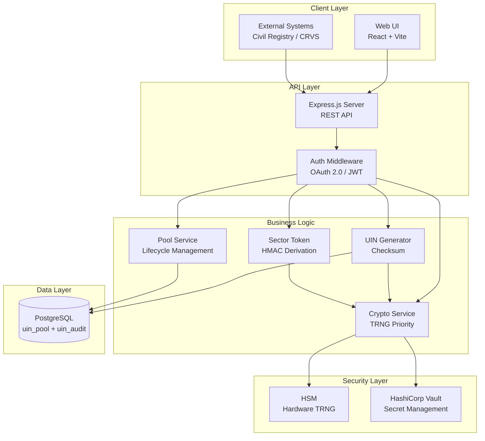
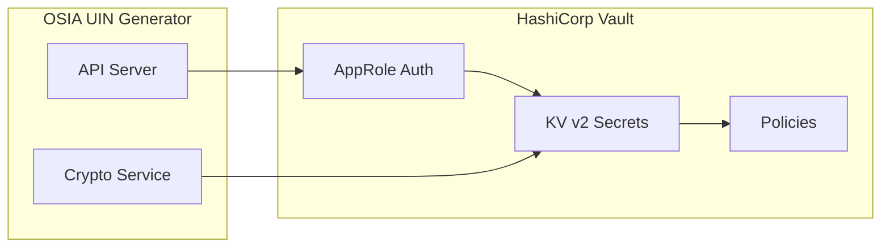
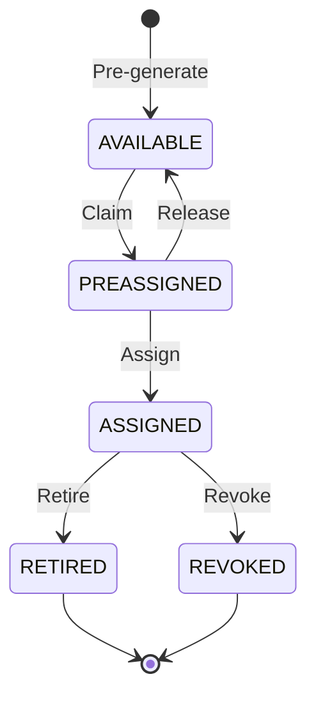
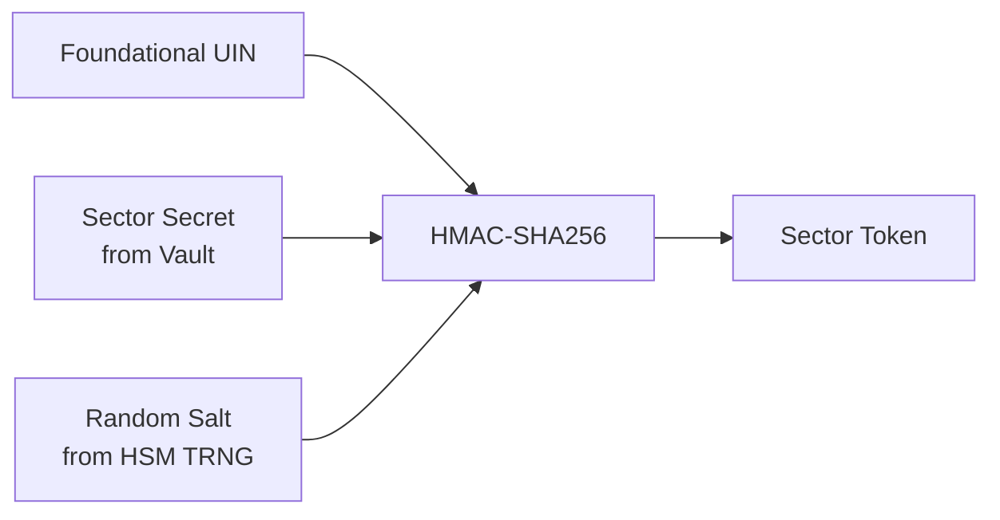
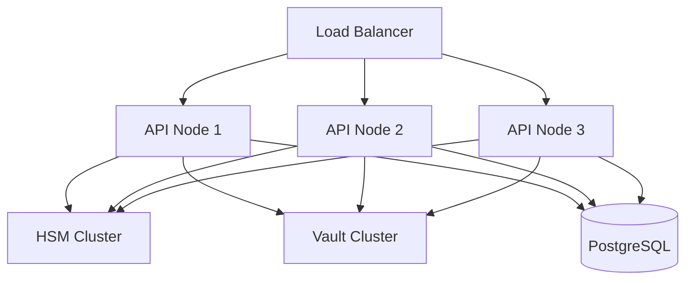

# OSIA UIN Generator v2.0

A production-grade, PostgreSQL-backed **Unique Identification Number (UIN)** generator based on the **[Open Standards for Identity APIs (OSIA)](https://osia.readthedocs.io/)** specification.

**Author:** Tunji Durodola <tunji.d@pocketone.eu>
**Organization:** [Secure Identity Alliance](https://secureidentityalliance.org)
**License:** MIT

---

## Table of Contents

- [Features](#features)
- [Architecture](#architecture)
- [Quick Start](#quick-start)
- [Hardware Security Module (HSM)](#hardware-security-module-hsm)
- [HashiCorp Vault Integration](#hashicorp-vault-integration)
- [API Reference](#api-reference)
- [UIN Lifecycle](#uin-lifecycle)
- [Generation Modes](#generation-modes)
- [Database Schema](#database-schema)
- [Security](#security)
- [Configuration](#configuration)
- [Terraform Infrastructure](#terraform-infrastructure)
- [Deployment](#deployment)
- [Web Interface](#web-interface)
- [Testing](#testing)
- [References](#references)
- [License](#license)

---

## Features

- **OSIA-Based Design** - Implements `POST /v1/uin` endpoint pattern (OSIA v1.2.0)
- **Four Generation Modes** - Foundational, Random, Structured, and Sector Token
- **PostgreSQL Pool Management** - Pre-generation, claiming, and assignment workflows
- **HSM Integration** - Hardware TRNG priority with PKCS#11 support
- **HashiCorp Vault** - Centralized secret management with AppRole authentication
- **Cryptographic Security** - Hardware TRNG, HMAC-SHA256, RIPEMD-160 hashing
- **Entropy Provenance Tracking** - Identify UIN entropy source (HSM TRNG vs software CSPRNG)
- **Complete Audit Trail** - Immutable logging of all UIN lifecycle events
- **Sector Tokenization** - Unlinkable, sector-specific derived identifiers
- **Multi-Format Output** - JSON, JWT (RFC 7519), and JSON-LD (W3C Linked Data)
- **Format Configuration** - Customizable display formats with separator and grouping options
- **React Web UI** - Professional interface with dark mode and multilingual support (EN, DE, FR, ES)
- **Pool Lifecycle Testing** - UI for fetch, pre-assign, assign, revoke, retire operations
- **Terraform IaC** - Multi-host deployment with GitHub Actions CI/CD

### Supported Sectors

| Sector | Description |
|--------|-------------|
| `health` | Healthcare / Medical services |
| `tax` | Tax / Revenue administration |
| `finance` | Financial services |
| `telco` | Telecommunications |
| `stats` | Statistics / Census |
| `education` | Education sector |
| `social` | Social services |
| `government` | Government / Public administration |

---

## Architecture

### High-Level System Overview



### Technology Stack

| Layer | Technology | Version |
|-------|------------|---------|
| Runtime | Node.js | 20+ |
| Server | Express.js | 4.x |
| Database | PostgreSQL | 17+ |
| Query Builder | Knex.js | 3.x |
| Frontend | React | 18.x |
| Build Tool | Vite | 5.x |
| Process Manager | PM2 | 6.x |
| Secret Management | HashiCorp Vault | 1.15+ |
| HSM Interface | PKCS#11 / graphene-pk11 | 2.x |
| IaC | Terraform | 1.5+ |

---

## Quick Start

### Prerequisites

- Node.js 20+
- PostgreSQL 15+ (17+ recommended)
- PM2 (optional, for production)
- HashiCorp Vault (optional, for secret management)
- HSM with PKCS#11 support (optional, for hardware TRNG)

### Installation

```bash
# Clone the repository
git clone https://github.com/tunjidurodola/osia_uin_generator.git
cd osia_uin_generator

# Install dependencies
npm install

# Install web UI dependencies
cd web && npm install && cd ..

# Configure environment (copy and edit)
cp .env.example .env

# Run database migrations
npm run migrate

# Start the API server
npm start

# Or use PM2 for production
pm2 start ecosystem.config.cjs
```

### Verify Installation

```bash
# Health check
curl http://localhost:19020/health

# Check cryptographic services status
curl http://localhost:19020/crypto/status

# Generate a UIN (stateless)
curl -X POST http://localhost:19020/generate \
  -H "Content-Type: application/json" \
  -d '{"mode": "foundational"}'
```

---

## Hardware Security Module (HSM)

The OSIA UIN Generator supports Hardware Security Modules for cryptographic operations. **When an HSM with hardware TRNG is available, it is always prioritized over software-based random number generation.**

### Random Number Generation Priority

```
1. HSM Hardware TRNG (Thales, SafeNet, Utimaco, etc.)
   └── FIPS 140-2 Level 3 certified entropy source
2. Node.js CSPRNG (crypto.randomBytes)
   └── Software-based fallback
```

### Supported HSM Providers

| Provider | Type | TRNG | FIPS Level | Description |
|----------|------|------|------------|-------------|
| **Thales Luna** | Production | Yes | Level 3 | Enterprise network HSM |
| **SafeNet** | Production | Yes | Level 3 | ProtectServer, Luna legacy |
| **Utimaco** | Production | Yes | Level 3 | CryptoServer/SecurityServer |
| **nCipher/Entrust** | Production | Yes | Level 3 | nShield HSM |
| **AWS CloudHSM** | Cloud | Yes | Level 3 | AWS managed HSM |
| **Azure Dedicated HSM** | Cloud | Yes | Level 3 | Thales Luna-based |
| **YubiHSM 2** | Compact | Yes | Level 2 | USB HSM |
| **SoftHSM** | Development | No | - | Testing only |

### HSM Auto-Detection

The system automatically detects available HSMs in priority order:

```javascript
// Priority order (production HSMs first)
1. Thales Luna
2. SafeNet
3. Utimaco
4. nCipher/Entrust
5. AWS CloudHSM
6. Azure Dedicated HSM
7. YubiHSM
8. SoftHSM (development only)
```

### HSM Configuration

```bash
# Enable HSM
HSM_ENABLED=true

# Auto-detect HSM (recommended)
HSM_PROVIDER=auto

# Or specify provider explicitly
HSM_PROVIDER=thales|safenet|utimaco|ncipher|aws-cloudhsm|yubihsm|softhsm

# Custom library path (optional)
HSM_LIBRARY=/opt/safenet/lunaclient/lib/libCryptoki2_64.so

# HSM slot and authentication
HSM_SLOT=0
HSM_PIN=your-hsm-pin

# Key label for sector token derivation
HSM_KEY_LABEL=osia-sector-key
```

### HSM Status API

```bash
GET /crypto/status

# Response
{
  "hsm": {
    "enabled": true,
    "provider": "thales",
    "providerName": "Thales Luna",
    "providerType": "production",
    "hasTrng": true,
    "fipsLevel": 3,
    "mode": "hardware",
    "randomSource": "Thales Luna Hardware TRNG"
  }
}
```

---

## HashiCorp Vault Integration

HashiCorp Vault provides centralized secret management for sector secrets, database credentials, and HSM configuration.

### Vault Architecture



### Vault Configuration

```bash
# Enable Vault
VAULT_ENABLED=true

# Vault server address
VAULT_ADDR=http://127.0.0.1:8200

# Token authentication (development)
VAULT_TOKEN=your-root-token

# AppRole authentication (production - recommended)
VAULT_ROLE_ID=your-role-id
VAULT_SECRET_ID=your-secret-id

# Optional namespace (Vault Enterprise)
VAULT_NAMESPACE=admin
```

### Secrets Structure

```
osia/
├── sector-secrets     # HMAC secrets per sector
│   ├── health
│   ├── tax
│   ├── finance
│   └── ...
├── database           # PostgreSQL credentials
│   ├── host
│   ├── port
│   ├── username
│   └── password
└── hsm                # HSM configuration
    ├── provider
    ├── library
    ├── slot
    └── pin
```

### Vault Status API

```bash
GET /crypto/status

# Response includes
{
  "vault": {
    "enabled": true,
    "authenticated": true,
    "address": "http://127.0.0.1:8200"
  },
  "secretsLoaded": 8
}
```

---

## API Reference

### Information Endpoints

| Method | Endpoint | Description |
|--------|----------|-------------|
| `GET` | `/` | API information and available endpoints |
| `GET` | `/health` | Health check with HSM/Vault status |
| `GET` | `/crypto/status` | Cryptographic services status |
| `GET` | `/modes` | List available generation modes |
| `GET` | `/sectors` | List supported sectors |

### OSIA-Compliant Endpoint

#### `POST /v1/uin`

Generate a new UIN following the OSIA v1.2.0 endpoint pattern.

**Query Parameters:**

| Parameter | Type | Required | Description |
|-----------|------|----------|-------------|
| `transactionId` | string | Yes | Transaction identifier for tracking |

**Response (200 OK):**

```
"ABCD1234EFGH5678XYZ"
```

### Stateless Generation Endpoints

| Method | Endpoint | Description |
|--------|----------|-------------|
| `POST` | `/generate` | Generate UIN without database persistence |
| `POST` | `/validate` | Validate a UIN (checksum, format) |
| `POST` | `/batch` | Generate multiple UINs in one request |

### Pool Management Endpoints

| Method | Endpoint | Description |
|--------|----------|-------------|
| `GET` | `/pool/stats` | Get pool statistics by scope |
| `GET` | `/pool/peek` | Preview top available UINs without claiming |
| `POST` | `/pool/preassign` | Pre-assign a UIN (UI-friendly, AVAILABLE → PREASSIGNED) |
| `POST` | `/pool/assign` | Assign a pre-assigned UIN (UI-friendly, PREASSIGNED → ASSIGNED) |
| `POST` | `/pool/revoke` | Revoke a UIN (UI-friendly, → REVOKED) |
| `POST` | `/pool/retire` | Retire a UIN (UI-friendly, → RETIRED) |

### UIN Lifecycle Endpoints

| Method | Endpoint | Description |
|--------|----------|-------------|
| `POST` | `/uin/pre-generate` | Batch pre-generate UINs into pool |
| `POST` | `/uin/claim` | Claim available UIN (AVAILABLE → PREASSIGNED) |
| `POST` | `/uin/assign` | Assign UIN to entity (PREASSIGNED → ASSIGNED) |
| `POST` | `/uin/release` | Release UIN back to pool (PREASSIGNED → AVAILABLE) |
| `POST` | `/uin/status` | Update UIN status (retire, revoke, etc.) |
| `POST` | `/uin/cleanup-preassigned` | Release stale pre-assigned UINs |
| `GET` | `/uin/:uin` | Lookup UIN details |
| `GET` | `/uin/:uin/audit` | Get complete audit trail |

### Format Configuration Endpoints

| Method | Endpoint | Description |
|--------|----------|-------------|
| `GET` | `/formats` | List all format configurations |
| `GET` | `/formats/:code` | Get format by code |
| `POST` | `/formats` | Create new format configuration |
| `PUT` | `/formats/:code` | Update format configuration |
| `DELETE` | `/formats/:code` | Delete format configuration |

### Example: Pool Lifecycle Testing

```bash
# 1. Fetch a UIN from the pool (peek without claiming)
curl "http://localhost:19020/pool/peek?status=AVAILABLE&limit=1"

# 2. Pre-assign a UIN (reserves it)
curl -X POST http://localhost:19020/pool/preassign \
  -H "Content-Type: application/json" \
  -d '{"scope": "foundational"}'

# 3. Assign the UIN to an entity
curl -X POST http://localhost:19020/pool/assign \
  -H "Content-Type: application/json" \
  -d '{"uin": "ABCD1234...", "entityId": "person-123"}'

# 4. Retire or revoke the UIN
curl -X POST http://localhost:19020/pool/retire \
  -H "Content-Type: application/json" \
  -d '{"uin": "ABCD1234...", "reason": "Death registration"}'
```

---

## UIN Lifecycle

### State Machine



### Lifecycle States

| Status | Description | Valid Transitions |
|--------|-------------|-------------------|
| `AVAILABLE` | Pre-generated, ready to be claimed | → PREASSIGNED |
| `PREASSIGNED` | Claimed, not yet bound to PII | → ASSIGNED, → AVAILABLE |
| `ASSIGNED` | Bound to a person/entity | → RETIRED, → REVOKED |
| `RETIRED` | No longer active (death) | Terminal |
| `REVOKED` | Invalidated (fraud) | Terminal |

---

## Generation Modes

### 1. Foundational Mode (Default)

High-entropy, lifelong identifier with no embedded PII. Uses HSM hardware TRNG when available.

```json
{
  "mode": "foundational",
  "length": 19,
  "charset": "A-Z0-9",
  "checksum": { "enabled": true, "algorithm": "iso7064" }
}
```

### 2. Random Mode

Fully configurable random identifiers with hardware entropy.

### 3. Structured Mode

Template-based generation with embedded values.

### 4. Sector Token Mode

Cryptographically derived, unlinkable sector-specific tokens.



---

## Security

### Cryptographic Components

| Component | Source | Purpose |
|-----------|--------|---------|
| Random Generation | HSM TRNG (priority) / Node.js CSPRNG | UIN generation |
| Integrity Hash | RIPEMD-160(SHA3-256(UIN+salt)) | UIN verification |
| Sector Derivation | HMAC-SHA256 via HSM | Unlinkable tokens |
| Secret Storage | HashiCorp Vault | Secure secrets |
| Key Protection | HSM (non-extractable) | HMAC keys |

### Security Best Practices

1. **Hardware TRNG Priority** - HSM TRNG is always preferred over CPU-based PRNG
2. **Vault for Secrets** - All sector secrets stored in HashiCorp Vault
3. **HSM Key Protection** - HMAC keys are non-extractable from HSM
4. **No PII in UIN** - Foundational mode embeds no personal data
5. **FIPS Compliance** - Production HSMs are FIPS 140-2 Level 3 certified
6. **Audit Immutability** - Audit records are append-only

---

## Configuration

### Environment Variables

```bash
# Server Configuration
PORT=19020
HOST=0.0.0.0
NODE_ENV=production

# Database (PostgreSQL)
OSIA_DB_HOST=localhost
OSIA_DB_PORT=5432
OSIA_DB_USER=osia_user
OSIA_DB_PASSWORD=secure_password
OSIA_DB_NAME=osia_prod

# HashiCorp Vault
VAULT_ENABLED=true
VAULT_ADDR=http://127.0.0.1:8200
VAULT_ROLE_ID=<role-id>
VAULT_SECRET_ID=<secret-id>

# HSM Configuration
HSM_ENABLED=true
HSM_PROVIDER=auto
HSM_SLOT=0
HSM_PIN=<hsm-pin>
HSM_KEY_LABEL=osia-sector-key

# Sector Secrets (if not using Vault)
SECTOR_SECRET_HEALTH=<32+ byte secret>
SECTOR_SECRET_TAX=<32+ byte secret>
# ... etc
```

---

## Terraform Infrastructure

### Multi-Host Deployment

The Terraform configuration supports deployment to multiple hosts:

| Host | IP Address | Role |
|------|------------|------|
| localhost | 127.0.0.1 | Development |
| node1 | 192.168.0.5 | API Server |
| node2 | 192.168.0.16 | API Server |
| node3 | 192.168.0.18 | API Server |

### Quick Start

```bash
cd terraform
cp terraform.tfvars.example terraform.tfvars
# Edit terraform.tfvars with your values

terraform init
terraform plan
terraform apply
```

### GitHub Actions CI/CD

The repository includes GitHub Actions workflows:

- **terraform.yml** - Terraform plan/apply/destroy with environment gates
- **codeql.yml** - CodeQL security analysis and npm audit

---

## Deployment

### PM2 Deployment

```bash
pm2 start ecosystem.config.cjs
pm2 logs osia-uin-api-dev
pm2 monit
```

### Production Architecture



---

## Web Interface

The React-based web interface provides a professional, full-width design with:

### Features

- **Generate UIN** - Mode selection, parameters, JWT/JSON-LD output formats
- **Pool Management** - Statistics, pre-generation with format selection, monitoring
- **UIN Lookup** - Search, details, audit trail with formatted display
- **Security** - HSM/Vault status, provider information, cryptographic services
- **Documentation** - API reference, Mermaid architecture diagrams

### Multilingual Support

The UI supports four languages with a header dropdown selector:

| Language | Code | Flag |
|----------|------|------|
| English | EN | US |
| German | DE | DE |
| French | FR | FR |
| Spanish | ES | ES |

### Dark Mode

Full dark mode support with:
- Theme toggle in header
- Optimized Mermaid diagram rendering
- Consistent color variables throughout

### Format Configuration

UIN display formats can be configured with:
- Separator characters (dash, space, dot, custom)
- Group sizes for digit grouping
- Prefix/suffix text
- Format association stored in database (not the formatted value)

```bash
cd web
npm install
npm run build  # Production build
npm run dev    # Development server
```

---

## Testing

### Unit Tests

```bash
npm test
```

### Integration Tests

```bash
npm run test:db
```

### Health Check

```bash
curl http://localhost:19020/health

# Response includes HSM/Vault status
{
  "status": "healthy",
  "crypto": {
    "hsm": { "enabled": true, "hasTrng": true },
    "vault": { "enabled": true, "authenticated": true }
  }
}
```

---

## References

- [OSIA Specification](https://osia.readthedocs.io/en/stable/)
- [Secure Identity Alliance](https://secureidentityalliance.org)
- [PKCS#11 Specification](http://docs.oasis-open.org/pkcs11/pkcs11-base/v2.40/pkcs11-base-v2.40.html)
- [HashiCorp Vault Documentation](https://www.vaultproject.io/docs)
- [FIPS 140-2 Validation](https://csrc.nist.gov/projects/cryptographic-module-validation-program)
- [RFC 7519 - JSON Web Token (JWT)](https://tools.ietf.org/html/rfc7519)

---

## License

MIT License

Copyright (c) 2025 Tunji Durodola, Secure Identity Alliance

Permission is hereby granted, free of charge, to any person obtaining a copy of this software and associated documentation files (the "Software"), to deal in the Software without restriction, including without limitation the rights to use, copy, modify, merge, publish, distribute, sublicense, and/or sell copies of the Software, and to permit persons to whom the Software is furnished to do so, subject to the following conditions:

The above copyright notice and this permission notice shall be included in all copies or substantial portions of the Software.

THE SOFTWARE IS PROVIDED "AS IS", WITHOUT WARRANTY OF ANY KIND, EXPRESS OR IMPLIED, INCLUDING BUT NOT LIMITED TO THE WARRANTIES OF MERCHANTABILITY, FITNESS FOR A PARTICULAR PURPOSE AND NONINFRINGEMENT. IN NO EVENT SHALL THE AUTHORS OR COPYRIGHT HOLDERS BE LIABLE FOR ANY CLAIM, DAMAGES OR OTHER LIABILITY, WHETHER IN AN ACTION OF CONTRACT, TORT OR OTHERWISE, ARISING FROM, OUT OF OR IN CONNECTION WITH THE SOFTWARE OR THE USE OR OTHER DEALINGS IN THE SOFTWARE.
